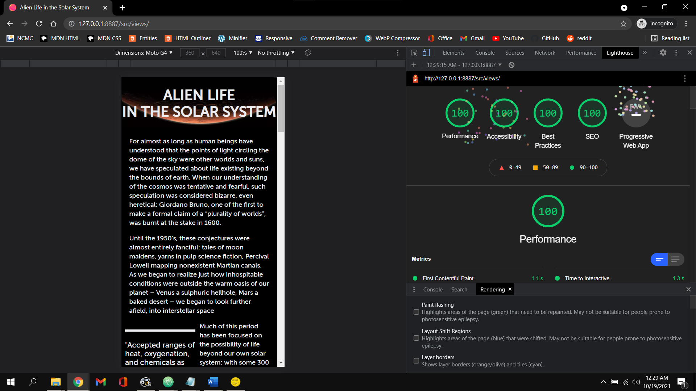
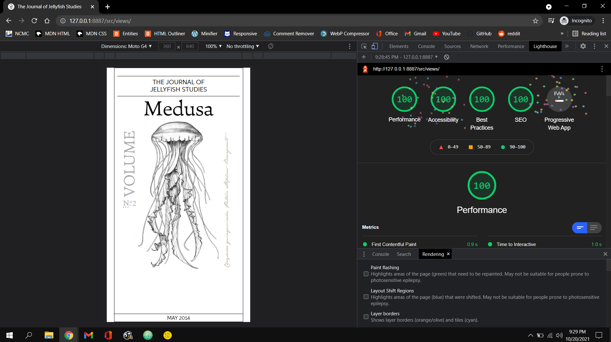

This assignment went a lot smoother than a02. I was able to do a lot more reading this time around as I was more confident in my abilities after the last assignment and I finished up the remaining 8 chapters of Interneting Is Hard before I moved on to a03 and I was able to complete each website in about 2 days a piece. I'm really happy with how both of my websites turned out. I believe they are almost perfect recreations and I honestly don't think they could look any closer visually. Admiittedly, my CSS is a little messy in my Alien Life website as there are quite a few repeated rules that could have been put into their own class so I wouldn't have to type them out over and over again. I was going to go back and clean it up a bit after I finished a03b but I ran out of time. Appearance wise however, they both look immacualte.

